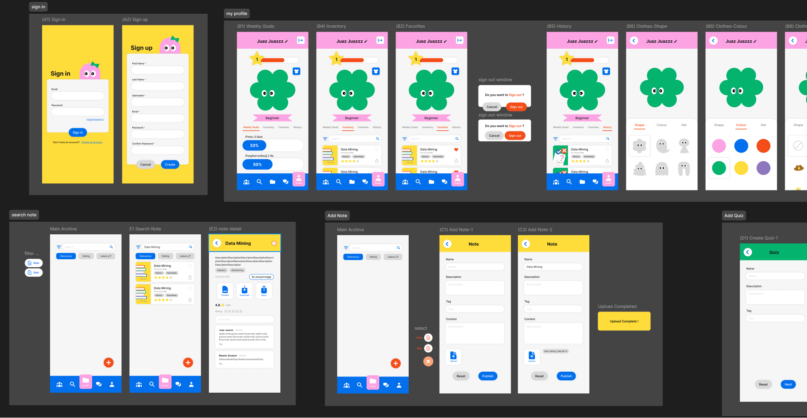

## What is Startdii?
Startdii เป็น Application เพื่อการศึกษา สำหรับโทรศัพท์มือถือในระบบปฏิบัติการ Android โดยมีจุดมุ่งหมายให้เป็นแพลตฟอร์มที่ส่งเสริมการช่วยกันเรียนรู้ระหว่างกลุ่มผู้ใช้งาน โดยมีระบบเพื่ออำนวยความสะดวกในการแบ่งปันความรู้ ทั้งระบบการแบ่งปันสรุปเนื้อหาลงในคลังความรู้ ระบบสร้างแบบทดสอบ และระบบ Guild พร้อมกับ feature อื่นๆ ในแอปพลิเคชัน เพื่อรองรับให้ผู้ใช้งานสามารถเป็นทั้งผู้แบ่งปันความรู้ และเป็นผู้เรียนรู้ได้พร้อมๆ กันผ่านแพลตฟอร์มของเรา
เนื่องจากแอปพลิเคชันอื่นๆ ที่คล้ายกันที่มีอยู่ในตลาดตอนนี้นั้นมีลักษณะหลักๆ อยู่เพียง 2 ประเภท หนึ่งคือแอปพลิเคชันสำหรับแบบทดสอบโดยเฉพาะ และอีกแบบหนึ่งคือแอปพลิเคชันสำหรับอ่านหนังสือหรือตำราเรียนออนไลน์ ซึ่งไม่ค่อยมีการจัดระเบียบและรวบรวมไว้อย่างเป็นระบบ และเน้นการเรียนรู้ด้วยตนเองมากกว่า จึงทำให้ Application Startdii นั้นเข้ามาแก้ปัญหาของแอปพลิเคชันทั้งสองแบบ โดยการรวบรวมแหล่งข้อมูล ความรู้ หนังสือ และคำถามต่างๆ เข้ามาจัดระเบียบและแบ่งปันลงในคลังความรู้รวมที่ทุกคนสามารถเข้าถึงได้ ซึ่งทั้งหมดนี้ Operate โดยตัวผู้ใช้งานเอง ทำให้ส่งเสริมการเรียนรู้และการแบ่งปันความรู้ร่วมกัน

## UX/UI Preview from Figma

## Framework for Back-end
- NodeJs : https://nodejs.org/en/download/package-manager (Front/Back) [สำหรับรันJavaScript ที่เครื่อง🏃🏾‍♂️ ]
- Git : https://git-scm.com/downloads (Front/Back) [ไว้สำหรับฝากโค้ด / ทำงานร่วมกัน🤼 ]
- Docker : https://www.docker.com/ (Back) [รันMongodb ที่เครื่อง🏃🏾‍♂️ ]
- Mongodb Compass : https://www.mongodb.com/try/download/compass (Back/Front) [ไว้สำหรับดูDatabaseด้วยตาของคุณ👁️ ]
- flux : https://justgetflux.com/ (คนเขียนโค้ด) [ไว้สำหรับลดแสงสีฟ้ากันตาคุณบอด😎 ]

## Framework for Front-end
- NodeJs : https://nodejs.org/en/download/package-manager (Front/Back) [สำหรับรันJavaScript ที่เครื่อง🏃🏾‍♂️ ]
- Git : https://git-scm.com/downloads (Front/Back) [ไว้สำหรับฝากโค้ด / ทำงานร่วมกัน🤼 ]
- Android Emulator(Optional) : https://docs.expo.dev/get-started/set-up-your-environment/?mode=expo-go&platform=android&device=simulated
- Expo Go : Google Play Store (บนมือถือ)
